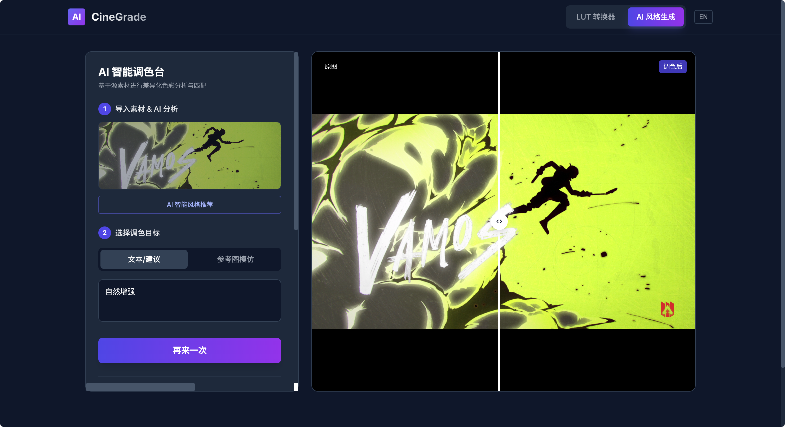

<div align="center">
  
</div>

# CineGrade AI

一个针对语义驱动调色场景的探索。通过“参考图分析”“风格提示词生成”“参数化调色”“LUT 导出”和“格式转换”组合成一套轻量工作台，用户既可以根据参考画面快速生成风格化 LUT，也可以在不同相机 / 色彩空间之间完成 LUT 转换与适配。

## 产品定位

这个项目解决的不是“复杂节点式专业调色”，而是“让更多用户更快得到一个可用的电影感调色结果”。

它站在传统调色软件和自动化风格生成之间：

- 对创作者来说，它降低了从参考风格到 LUT 的门槛
- 对后期团队来说，它提供了更快的 look 试错入口
- 对工具团队来说，它提供了一个 AI 驱动调色台的产品原型

从产品视角看，CineGrade AI 更像一个“AI Look 生成 + LUT 工作流助手”，而不是完整的调色系统替代品。

## 面向的用户

- 独立创作者和短视频制作者：快速得到风格化 LUT
- 调色与后期团队：用参考图或提示词快速尝试 look
- 摄影与 DIT 场景：在不同相机 profile 之间做 LUT 适配和转换
- 影像工具产品团队：验证 AI 调色台的产品形态与交互方式

## 核心使用流程

1. 上传一张源素材截图
2. 选择工作方式：
   - 输入风格提示词
   - 上传参考风格图
3. AI 分析画面并生成调色参数
4. 在预览区查看调色前后效果
5. 选择导出格式，生成 LUT
6. 下载 `.cube` 或 HaldCLUT PNG

另一条并行流程是：

1. 上传已有 LUT 文件
2. 选择源色彩空间和目标色彩空间
3. 生成转换说明
4. 输出新的 LUT 格式

## 当前版本能力

### 1. AI 智能调色生成

- 支持基于文本提示词生成调色参数
- 支持基于参考图匹配生成调色参数
- 支持先分析源图，再给出 AI 风格建议
- 支持记录多次生成结果，形成调色历史版本

### 2. LUT 导出

- 支持导出 `.cube`
- 支持导出 HaldCLUT `.png`
- 支持自动生成 LUT 文件内容
- 支持按当前活动版本下载对应 LUT

### 3. 预览与验证

- 支持源图预览
- 支持标准色卡预览
- 支持上传自定义测试图验证 LUT 效果
- 支持对比调色前后视觉差异

### 4. 通用 LUT 转换器

- 支持上传现有 LUT 文件
- 支持常见相机 / 色彩空间配置选择
- 支持 Rec.709、Sony S-Log3、Canon C-Log、Arri LogC、DJI D-Log、Blackmagic Film 等 profile
- 支持 `.cube`、`.3dl`、`.vlt`、`.png` 等输出目标

### 5. AI 服务接入

- 前端通过 `/api/generate` 调用服务端代理
- 服务端接入 Gemini 2.5 Flash
- 支持两类 AI 任务：
  - 风格建议生成
  - 调色参数生成

## 产品价值

这个项目的产品价值主要在三个层面：

- 把“我想要这种电影感”转化成“可导出的 LUT”
- 把“靠经验调色”前移为“先用 AI 生成一个可用起点”
- 把 LUT 生成和 LUT 转换放到同一个工作台里，缩短试错链路

相比传统专业调色软件，它更强调速度和入口友好；相比纯提示词生成工具，它又保留了 LUT 导出和工作流衔接能力。

## 适用场景

- 为短片、MV、Vlog 快速生成电影感 LUT
- 根据参考海报、电影剧照或品牌视觉生成 look
- 对既有 LUT 做跨相机 profile 的转换尝试
- 在前期定风格时快速试 look
- 作为更大后期产品中的 AI 调色模块原型

## 当前技术实现

这是一个前后端结合的轻量调色原型，核心实现包括：

- React 19 + TypeScript
- Vite 前端
- Gemini 2.5 Flash 服务端代理
- 基于参数模型的调色计算
- `.cube` 与 HaldCLUT PNG 生成
- 图像压缩与预览验证流程

当前生成逻辑并不是复杂的专业级色彩科学引擎，而是围绕“快速生成可用 look”构建的参数化调色模型。

## 当前边界与限制

这个版本适合作为产品 demo、原型验证和轻量工作台，但还不是完整的专业调色平台：

- AI 生成结果依赖提示词质量和参考图质量
- 当前调色核心基于参数化模型，不是完整的高阶色彩管理系统
- LUT 转换器中的部分转换流程仍偏演示型，AI 备注和处理流程未完全打通真实转换链路
- 当前更适合静态截图和 look 生成，不直接处理完整视频渲染任务
- 没有项目管理、协作、批量素材处理和版本归档能力

## 后续演进方向

- 接入更完整的色彩科学模型与相机 profile 映射
- 支持批量生成 LUT 与批量验证
- 增加更多导出格式和专业调色软件适配
- 增加真实视频帧序列预览与回放验证
- 加入 LUT 管理库、标签系统和风格模板市场
- 支持项目级 look 版本管理与团队协作

## 本地运行

### 环境要求

- Node.js
- Gemini API Key 或服务端 `API_KEY`

### 启动方式

```bash
npm install
npm run dev
```

### 构建生产包

```bash
npm run build
```

## 仓库结构

```text
CineGrade-AI/
├── App.tsx                      # 主工作台与双功能页切换
├── components/
│   ├── ImageToLut.tsx          # AI 调色生成与预览验证
│   ├── LutConverter.tsx        # LUT 转换器
│   └── Header.tsx              # 顶部导航与语言切换
├── services/
│   ├── geminiService.ts        # 前端 AI 调用封装
│   └── lutGenerator.ts         # LUT 生成与下载逻辑
├── api/
│   └── generate.js             # Gemini 服务端代理
├── types.ts                    # LUT、Profile 与调色参数类型
└── assets/
    └── readme-banner-v2.png    # README 展示图
```

## 一句话总结

CineGrade AI 是一个围绕“更快生成可用调色结果”设计的 AI 调色工作台：用参考图或提示词生成 look，用 LUT 导出衔接后期流程，用转换器连接不同设备与色彩空间。
